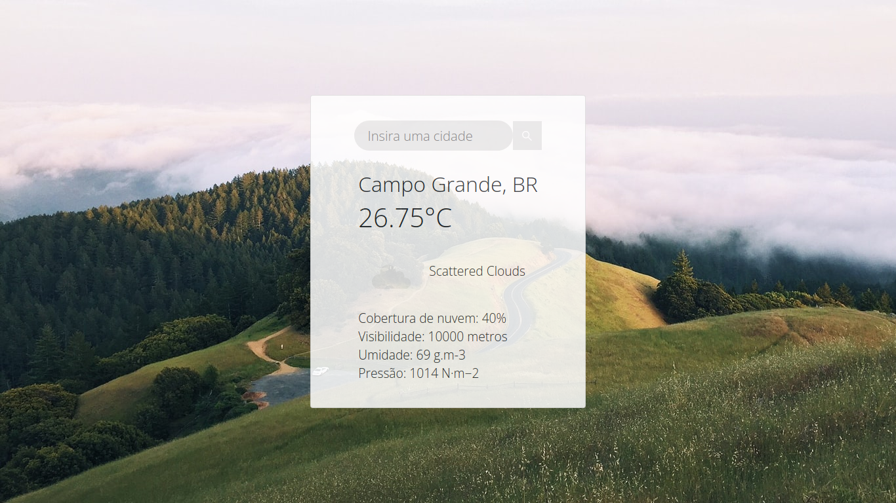

# Tempo Agora

## Sobre a API e funcionalidades

  Escolhi usar a API [OpenWeather](https://openweathermap.org/), pois já tinha vontade de trabalhar numa aplicação relacionada ao clima.
  
  Tempo Agora exibe a temperatura em graus Celsius, condição das nuvens, cobertura de nuvem, visibilidade, umidade e pressão a partir do nome da cidade, do estado ou do país que o usuário inserir. 
  
  O nome fornecido pelo usuário é inserido na URL de busca da API, que retorna as informações listadas acima e são renderizadas estaticamente no navegador. 
  

  Para a realização deste projeto utilizei as seguintes tecnologias: 
<ul>
  <li>Express - para criar o servidor e acessar a API.</li>
  <li>dotenv - acessar chaves ocultas no arquivo .env</li>
  <li>body-parser - realizar a análise do corpo das solicitações.</li>
  <li>request - fazer as chamadas http.</li>
  <li>EJS: Para converter o HTML e CSS para a página estática que é visualizada no navegador.</li>
</ul>

## Execução  

  Primeiramente é necessário que o Node.JS esteja instalado na máquina. 
  
  Clone este repositório e instale as depenêcias:

  ```node
  npm i express dotenv body-parser request ejs
  ```
  Em seguida, crie um arquivo .env na pasta raiz do repositório para inserir sua chave da API (pode ser obtida se cadastrando no site [OpenWeather](https://openweathermap.org/)). 

  ```
  API_KEY= (insira sua chave API)
  ```
   Deve aparacer uma mensagem informando que Tempo Agora está funcionando na porta 3000. Acesse a porta pelo navegador:

  ```
  localhost:3000
  ```

  A aplicação também pode ser acessada via Web, basta clicar [aqui](https://tempo-agora-2021.herokuapp.com/).

